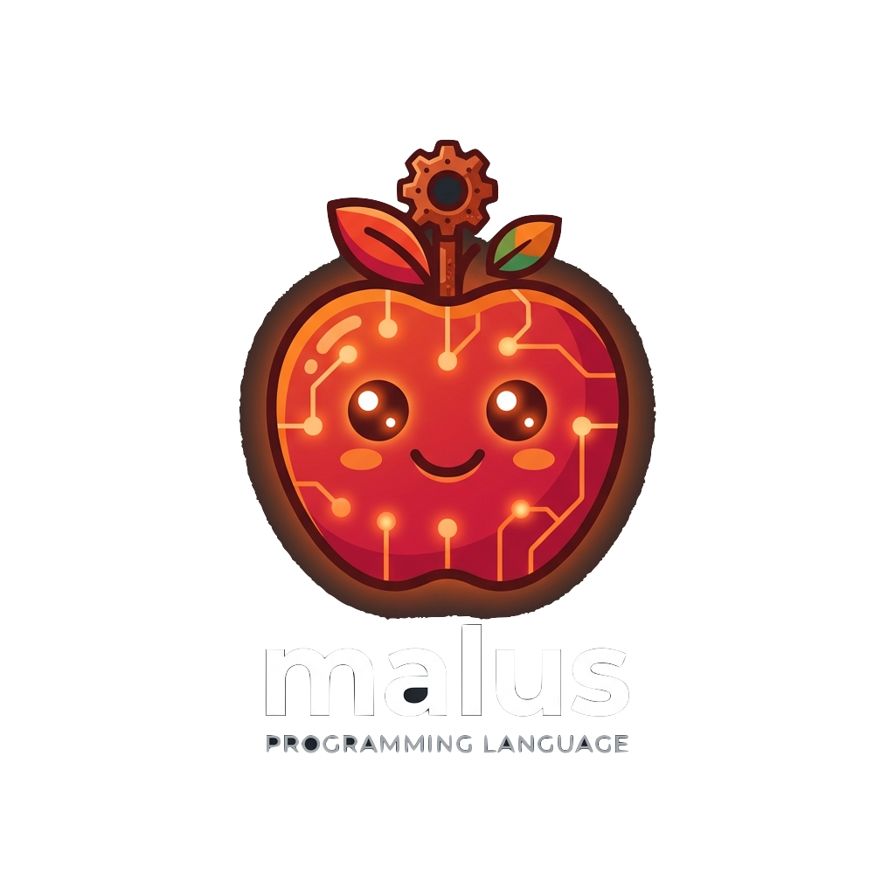

# malus

<p align="center">
  
</p>

A lightweight, high-performance domain-specific language for machine learning workloads on Apple Silicon (M-series) hardware. `malus` uses Python-like syntax with a dual-pipeline compilation model that cleanly separates CPU host orchestration from GPU device execution.

## Key features

- **`fn` / `kernel` split** — `fn` defines a CPU host function JIT-compiled via Cranelift; `kernel` defines a GPU device kernel compiled to Metal Shading Language (MSL)
- **Dual backends** — CPU code is JIT-compiled via [Cranelift](https://cranelift.dev/); GPU code is compiled to MSL and JIT-compiled by the Apple Metal driver
- **Built-in element-wise kernels** — `a + b` on tensors in `fn` bodies automatically synthesizes and dispatches a `malus_add` GPU kernel, indistinguishable from a user-written `kernel`
- **CTMM memory model** — automatic compile-time memory management via escape analysis; static `free`/barrier calls inserted at compile time, no GC, no RC on the fast path
- **Unified memory aware** — explicit placement semantics (`Tensor.gpu(...)`) with zero-copy transfers on Apple Silicon (`StorageModeShared`)

## Example

The V1 capstone: a 2→8→1 MLP that learns XOR in 10k steps.

```malus
kernel sigmoid_backward(grad_out: Tensor<f32>, sig_z: Tensor<f32>) -> Tensor<f32>:
    return grad_out * sig_z * (1.0 - sig_z)

fn main():
    let x      = Tensor.gpu<f32>([[0.0, 0.0], [0.0, 1.0], [1.0, 0.0], [1.0, 1.0]])
    let target = Tensor.gpu<f32>([[0.0], [1.0], [1.0], [0.0]])
    let ones41 = Tensor.gpu<f32>([[1.0], [1.0], [1.0], [1.0]])

    let mut w1 = Tensor.gpu<f32>([[0.5, -0.6, 0.7, -0.4, 0.3, -0.5, 0.6, -0.3],
                                   [-0.4, 0.5, -0.6, 0.7, -0.3, 0.4, -0.5, 0.6]])
    let mut b1 = Tensor.gpu<f32>([[0.1, -0.1, 0.1, -0.1, 0.1, -0.1, 0.1, -0.1]])
    let mut w2 = Tensor.gpu<f32>([[0.6], [-0.5], [0.4], [-0.6], [0.5], [-0.4], [0.6], [-0.5]])
    let mut b2 = Tensor.gpu<f32>([[0.0]])
    let lr = 1.5

    for step in range(10000):
        let z1  = x @ w1 + ones41 @ b1
        let h   = sigmoid(z1)
        let z2  = h @ w2 + ones41 @ b2
        let out = sigmoid(z2)

        let diff = out - target
        let loss = sum(diff * diff)
        if step == 9999:
            println("loss = {}", loss)
            println("predictions: {}", out)

        let dout = 2.0 * diff
        let dz2  = sigmoid_backward(dout, out)
        let dw2  = transpose(h) @ dz2
        let db2  = transpose(ones41) @ dz2
        let dh   = dz2 @ transpose(w2)
        let dz1  = sigmoid_backward(dh, h)
        let dw1  = transpose(x) @ dz1
        let db1  = transpose(ones41) @ dz1

        w1 = w1 - lr * dw1
        b1 = b1 - lr * db1
        w2 = w2 - lr * dw2
        b2 = b2 - lr * db2
```

```sh
$ malus examples/xor.ml
loss = [0.00012191984]
predictions: [0.0056860363, 0.99518234, 0.9939387, 0.005444207]
```

## Status

**V1 complete. V2 in progress (M13 done).**

### V1 — complete

- Dual-pipeline compilation — `fn` bodies JIT via Cranelift, `kernel` bodies compiled to MSL and dispatched on Metal
- CTMM memory model — static tensor `free` and GPU barrier insertion at compile time, no GC overhead
- Multi-statement kernel bodies — `let` bindings, comparison ops (producing float masks), and float literals inside `kernel`
- `let mut` + reassignment — mutable tensor bindings with safe old-value freeing; CTMM handles the barrier before the free
- Scalar broadcasting — `a * 0.5` and `0.5 * a` dispatch purpose-built GPU kernels; no ABI change required
- Built-in element-wise kernels — `a + b` in a `fn` body synthesizes and dispatches a `malus_add` kernel automatically
- Core math stdlib — `matmul`, `relu`, `sigmoid`, `tanh`, `exp`, `log`, `sqrt`, `abs`, `transpose`, `zeros`, `ones`, `sum`
- Control flow — `if`/`else`, `for`, `while` with hierarchical CTMM drop placement
- Structs + data-carrying enums + `match` — user-defined product/sum types with keyword construction and exhaustive match
- Fixed-length arrays — `Array<T, N>`, `for x in arr`, single-index, recursive per-element drop
- 2-D tensor literals — `Tensor.gpu<f32>([[r0c0, r0c1], [r1c0, r1c1]])` with rectangularity validation
- Ariadne diagnostics — source spans, underlines, and help text on all parse/type errors
- Multi-file imports — `import ops` / `from ops import add`
- Format-string printing — `println("loss: {}", tensor)`

### V2 — autograd (in progress)

- **M12** — Hardening: `break`/`continue`, zero-length tensor guard, enum-payload retain-on-bind
- **M13** — `Variable<f32>` type: type-directed ARC distinguishes differentiable tensors from plain tensors at compile time; CTMM emits `tensor_retain`/`tensor_release` only for `Variable` bindings; static `Drop` on `Tensor` is untouched. Aggregate boxes (structs, enums) gain an 8-byte ARC header; match-arm struct/enum payload escape is now safe via targeted `RetainAgg`/`ReleaseAgg` emission

## Project structure

```
crates/
  malus-syntax/       # lexer, parser, AST, pretty-printer
  malus-loader/       # module resolution + flattening
  malus-sema/         # type checker, CTMM (last-use + barrier insertion)
  malus-codegen-cpu/  # Cranelift JIT for fn bodies
  malus-codegen-gpu/  # MSL generation for kernel + built-in kernels
  malus-runtime/      # Metal API bindings, tensor ops, memory management
  malus-cli/          # script runner, entry point
docs/
  adr/                # architecture decision records (ADR-0001 through ADR-0014)
  milestones/         # milestone specs (M1–M11) and V1 plan
  spec/               # language spec
examples/
  add_tensors.ml      # basic kernel dispatch
  mlp_forward.ml      # 2-layer forward pass with relu/matmul/sum/transpose
  control_flow.ml     # for loop + nested if with tensor ops
  structs_enums.ml    # struct + data-carrying enum + match
  arrays.ml           # Array<T,N>, ForIn, indexing
  nested_tensor.ml    # 2-D tensor literal fed to matmul
  xor.ml              # V1 capstone: 2→8→1 sigmoid MLP that learns XOR
  import_demo/        # multi-file import
  hardening.ml        # M12: break/continue, zeros(0), enum-payload escape
  variable_rc.ml      # M13: Variable<f32> wrap/identity/data, zero-leak ARC
  payload_escape.ml   # M13: struct payload escaping a match arm via aggregate ARC
CONTEXT.md            # domain glossary
```

## Building

```sh
cargo build --release
./target/release/malus examples/xor.ml
```

Requires: Rust 1.78+, macOS 14+ with Xcode command line tools (Metal runtime is macOS-only; non-macOS builds compile but cannot execute GPU code).

## Architecture decisions

See [`docs/adr/`](./docs/adr/) for the key decisions behind malus's design, including dual-pipeline compilation (ADR-0001), CTMM memory model (ADR-0002), panic-only error model (ADR-0006), built-in kernel id allocation (ADR-0010), define-by-run autograd tape (ADR-0015), and type-directed RC for `Variable` vs `Tensor` (ADR-0016).
